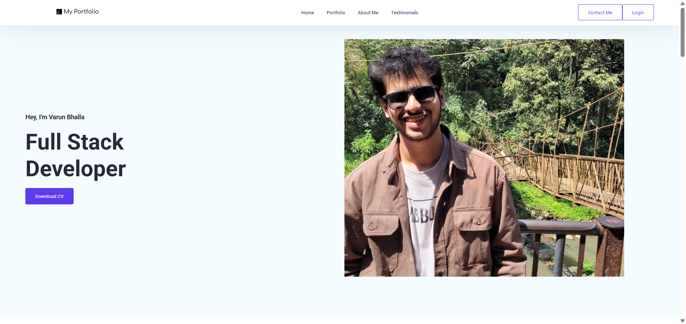
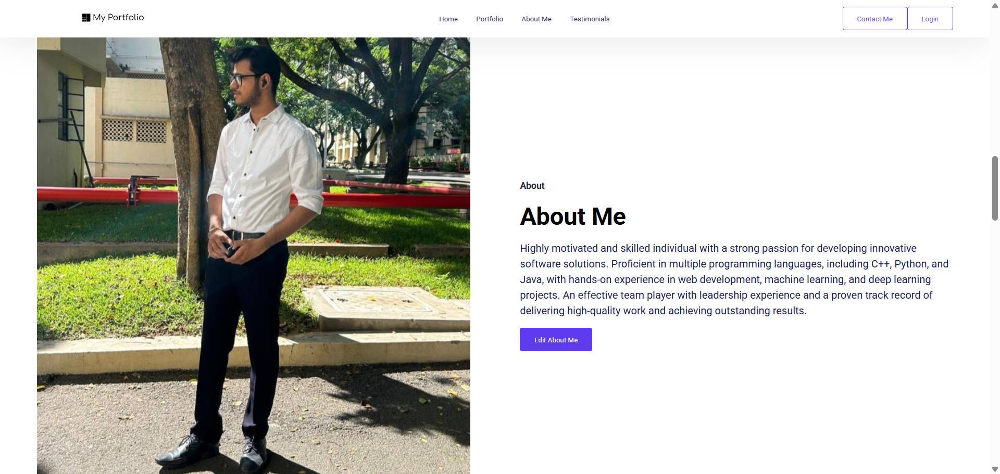
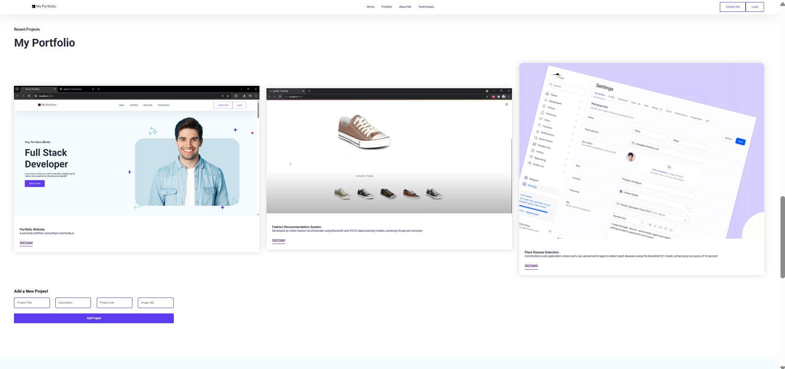
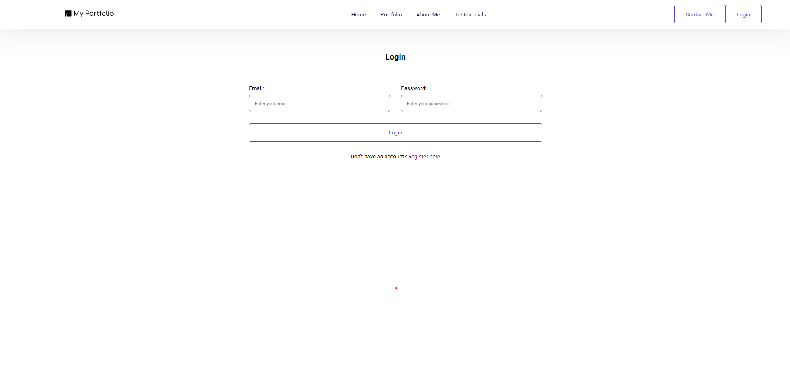

# React.js Portfolio with CMS

## 📌 Project Overview
I created a **Portfolio Website** using **React.js** that serves as my personal portfolio, showcasing my projects, skills, and achievements. The portfolio includes a **Content Management System (CMS)** that allows me to manage content dynamically.

Video Description : https://drive.google.com/file/d/1NCppYcxinxuIJDI7BARF-aAHe1kuG32L/view?usp=sharing



## 🚀 Features
### 🌟 **Frontend (React.js)**
- **Home Page**
  - **Hero Section**: Displays my photo, introduction, and a "Download CV" option.
  - **About Me Section**: Includes a brief description about me.
  - **My Portfolio Section**: Showcases my projects with links to view them.
  - **My Skills Section**: Displays my technical skills.
  - **Contact Me Section**: A form for visitors to reach out to me.





### 🔒 **Authentication & CMS**
- **Login & Register System**
  - Users can log in via the "Login" button on the navbar.
  - Passwords are hashed securely using **bcrypt**.
- **CMS Functionality**
  - Logged-in users can **add projects, add skills, and edit the "About Me" description**.



### 📩 **Contact Form with Nodemailer**
- The "Contact Me" form sends all details to my email using **Nodemailer**.

### 🛠️ **Backend (Node.js & Express.js)**
- Uses **Node.js** with **Express.js** to handle backend logic.
- Implements **RESTful APIs** to manage portfolio content.
- **Authentication & Authorization** with **JWT (JSON Web Tokens)**.

### 🗄️ **Database (MySQL)**
- Stores portfolio data in **MySQL** with the following tables:
  - **projects** (stores project details)
  - **skills** (stores skills data)
  - **users** (stores user credentials & authentication details)
  - **aboutme** (stores the "About Me" description)

## 🛠️ Technologies Used
- **Frontend**: React.js, HTML, CSS, JavaScript
- **Backend**: Node.js, Express.js
- **Database**: MySQL
- **Authentication**: bcrypt, JWT
- **Email Service**: Nodemailer

## 📌 Future Enhancements
- **Theme Customization**: Users can change the portfolio theme.
- **Blog Section**: Add a blog section for writing articles.
- **File Upload Support**: Allow users to upload images for projects.
- **Live Deployment**: Host the website on a cloud platform (e.g., Vercel, Netlify, AWS, or Heroku).

## 📂 How to Run the Project
### 1️⃣ Clone the Repository
```sh
git clone https://github.com/yourusername/your-repository.git
cd your-repository
```

### 2️⃣ Install Dependencies
```sh
npm install
cd client  # Navigate to frontend folder
npm install
```

### 3️⃣ Set Up the Backend
- Create a `.env` file in the root folder and add:
```env
PORT=5000
MYSQL_HOST=your-mysql-host
MYSQL_USER=your-mysql-username
MYSQL_PASSWORD=your-mysql-password
MYSQL_DATABASE=your-database-name
JWT_SECRET=your-secret-key
EMAIL_USER=your-email@gmail.com
EMAIL_PASS=your-email-password
```

- Start the backend:
```sh
npm start
```

### 4️⃣ Start the Frontend
```sh
cd client
npm start
```

## 🤝 Contributing
Feel free to suggest improvements or report issues!

---
Let me know if you want any modifications! 🚀

